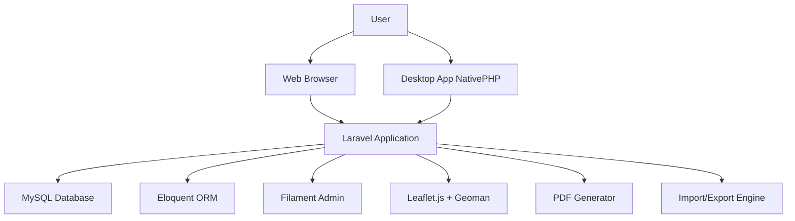
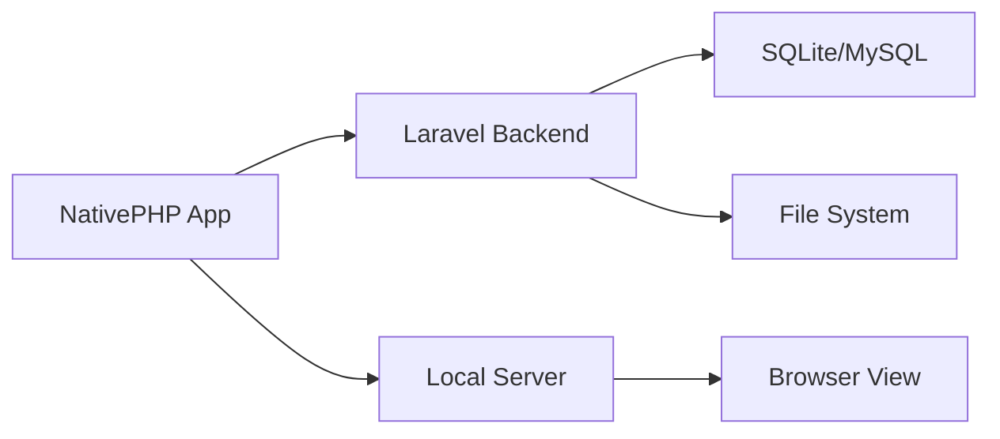
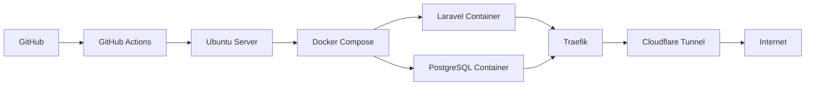

## Project Overview

**Sistem Informasi Administrasi Kependudukan (SIAK)** merupakan aplikasi manajemen data kependudukan yang dikembangkan untuk memenuhi kebutuhan administrasi di tingkat kelurahan. Project ini dimulai sebagai program magang di Kantor Kelurahan Kalicari dan kemudian dikembangkan lebih lanjut sebagai Tugas Akhir.

Aplikasi ini mengelola data penduduk, keluarga, RT, RW, fasilitas umum, dan usaha milik warga, serta menyediakan fitur pelaporan dan visualisasi geografis. Dalam perkembangannya, SIAK diadaptasi menjadi aplikasi desktop offline menggunakan NativePHP dan diintegrasikan dengan Geographic Information System (GIS) menggunakan Leaflet.js.

---

## Project Information

| **Aspek**        | **Detail**                                                     |
| ---------------- | -------------------------------------------------------------- |
| **Nama Project** | Sistem Informasi Administrasi Kependudukan (SIAK)              |
| **Peran**        | IT / Web Developer                                             |
| **Lokasi**       | Kantor Kelurahan Kalicari                                      |
| **Status**       | Production, kemudian eksperimen self-hosting                   |
| **Repository**   | [GitHub - ibrammalik/SIAK](https://github.com/ibrammalik/SIAK) |
| **Demo**         | [https://siak.ibra.im](https://siak.ibra.im)                   |
| **Manual Book**  | [bit.ly/3TRtKno](https://bit.ly/3TRtKno)                       |

---

## Technology Stack

### Application

- **Backend Framework:** Laravel
- **Admin Panel:** Filament
- **Frontend:** Tailwind CSS, JavaScript
- **Database:** MySQL, Eloquent ORM
- **GIS:** Leaflet.js, Geoman
- **Desktop:** NativePHP

### Deployment

- **Production:** cPanel

### Personal Homelab (Eksperimen)

- **OS:** Ubuntu Linux
- **Containerization:** Docker, Docker Compose
- **Database:** PostgreSQL
- **Version Control:** Git, GitHub
- **CI/CD:** GitHub Actions
- **Reverse Proxy:** Traefik
- **Tunnel:** Cloudflare Tunnel

> **Note:** Teknologi pada homelab digunakan untuk eksperimen dan self-hosting, bukan untuk deployment production saat magang.

---

## Background & Problem

Kelurahan Kalicari menghadapi beberapa tantangan dalam pengelolaan administrasi kependudukan:

1. **Pencatatan manual** - Data penduduk masih dicatat menggunakan buku dan spreadsheet, menyebabkan duplikasi data dan kesulitan dalam pencarian.
2. **Pelaporan lambat** - Pembuatan laporan monografi memakan waktu karena data tersebar di berbagai sumber.
3. **Tidak terintegrasi** - Data RT, RW, dan kelurahan tidak terhubung dengan baik, menyulitkan analisis wilayah.
4. **Tidak ada visualisasi** - Tidak ada peta atau visualisasi untuk melihat sebaran penduduk dan fasilitas di wilayah kelurahan.

---

## Goals

1. **Mempermudah pencatatan data penduduk** - Menyediakan antarmuka digital yang efisien untuk input data.
2. **Mempermudah pengelolaan data administrasi** - Menyediakan fitur CRUD, search, filtering, import, dan export data.
3. **Mempermudah pembuatan laporan monografi** - Menyediakan laporan PDF secara otomatis berdasarkan data terkini.
4. **Menyediakan visualisasi geografis** - Menampilkan wilayah kelurahan, RT, RW, dan fasilitas umum dalam peta interaktif.
5. **Dapat diakses offline** - Mengadaptasi aplikasi web menjadi desktop application.

---

## Requirements

### Functional Requirements

1. Aplikasi dapat mengelola data penduduk (CRUD, search, filter).
2. Aplikasi dapat mengelola data keluarga.
3. Aplikasi dapat mengelola data RT dan RW.
4. Aplikasi dapat mengelola data kelurahan.
5. Aplikasi dapat mengelola data fasilitas umum.
6. Aplikasi dapat mengelola data usaha milik warga.
7. Aplikasi dapat mengimpor data dari file.
8. Aplikasi dapat mengekspor data ke berbagai format.
9. Aplikasi dapat membuat laporan PDF dan laporan monografi.
10. Aplikasi dapat menampilkan peta wilayah dengan polygon.
11. Aplikasi dapat mengelola polygon wilayah RT, RW, dan kelurahan.
12. Aplikasi dapat dijalankan secara offline sebagai desktop application.

### Non-functional Requirements

1. Aplikasi harus responsif dan mudah digunakan.
2. Aplikasi harus aman untuk data pribadi penduduk.
3. Aplikasi harus dapat di-deploy dengan mudah.

---

## Role & Contribution

Sebagai IT/Web Developer, kontribusi saya meliputi:

- **Analisis kebutuhan** - Berdiskusi dengan pihak kelurahan untuk memahami kebutuhan dan proses bisnis.
- **Perancangan database** - Merancang struktur database relasional untuk mendukung semua entitas.
- **Pengembangan backend** - Mengimplementasikan logika bisnis menggunakan Laravel.
- **Pengembangan frontend** - Membangun antarmuka pengguna dengan Filament, Tailwind CSS, dan JavaScript.
- **GIS integration** - Mengintegrasikan Leaflet.js dan Geoman untuk visualisasi peta.
- **Desktop adaptation** - Mengadaptasi aplikasi menjadi desktop menggunakan NativePHP.
- **Deployment** - Deploy aplikasi ke cPanel dan eksperimen self-hosting di homelab.

---

## Features

### Core Features

- Dashboard
- Data Penduduk (CRUD, Search, Filtering)
- Data Keluarga (CRUD, Search, Filtering)
- Data RT (CRUD)
- Data RW (CRUD)
- Data Kelurahan (CRUD)
- Fasilitas Umum (CRUD, Map)
- Usaha Milik Warga (CRUD, Map)
- Import Data
- Export Data
- Laporan PDF
- Laporan Monografi
- GIS (Polygon Management)
- Authentication & Authorization
- Desktop Application (NativePHP)

---

## System Architecture

### Application Architecture



### Desktop/Offline Architecture



### Personal Homelab Architecture



---

## Application Architecture

### Backend (Laravel)

Laravel digunakan sebagai framework utama dengan arsitektur MVC (Model-View-Controller). Beberapa implementasi utama:

- **Routing** - Menangani HTTP requests dan mengarahkannya ke controller yang sesuai.
- **Controllers** - Mengelola logika bisnis dan interaksi antar model.
- **Models** - Mewakili entitas database menggunakan Eloquent ORM.
- **Migrations** - Mengelola skema database.
- **Middleware** - Menangani autentikasi dan authorization.
- **Service Providers** - Mendaftarkan service dan binding ke container.

### Admin Panel (Filament)

Filament digunakan sebagai admin panel dengan fitur:

- Resource management untuk semua entitas.
- Form builder untuk input data.
- Table builder untuk tampilan data dengan search, filter, dan sorting.
- Widgets untuk dashboard.
- Relation managers untuk mengelola relasi antar entitas.

### Frontend

- **Tailwind CSS** - Utility-first CSS framework untuk styling.
- **JavaScript** - Menangani interaktivitas dan integrasi dengan library pihak ketiga.
- **Leaflet.js** - Library open-source untuk peta interaktif.
- **Geoman** - Plugin untuk editing polygon di Leaflet.

---

## Database Design

### Relational Database

Database menggunakan MySQL dengan pendekatan relasional untuk memastikan integritas data. Entitas utama yang terlibat:

- **Penduduk** - Menyimpan data individu penduduk.
- **Keluarga** - Menyimpan data keluarga dan relasi dengan penduduk.
- **RT** - Menyimpan data Rukun Tetangga.
- **RW** - Menyimpan data Rukun Warga.
- **Kelurahan** - Menyimpan data kelurahan.
- **Fasilitas Umum** - Menyimpan data fasilitas umum dengan koordinat.
- **Usaha Milik Warga** - Menyimpan data usaha dengan koordinat.

### Entity Relationship Diagram


_[Diagram ERD aktual untuk SIAK akan ditampilkan di sini]_

### Database Relationship

Database relationship sangat penting karena:

1. **Data Integrity** - Relasi memastikan data terhubung dengan benar (contoh: penduduk terhubung dengan keluarga, RT, dan RW).
2. **Query Efficiency** - Relasi memungkinkan join query yang efisien untuk laporan dan analisis.
3. **Consistency** - Cascade delete/update menjaga konsistensi data.
4. **Business Logic** - Relasi mencerminkan struktur organisasi dan administrasi yang sebenarnya.

---

## Database Implementation

### Key Models & Relationships

Model-model utama dan relasinya diimplementasikan menggunakan Eloquent ORM:

```php
// Example implementation — replace with actual project code
class Penduduk extends Model
{
    public function keluarga()
    {
        return $this->belongsTo(Keluarga::class);
    }

    public function rt()
    {
        return $this->belongsTo(RT::class);
    }

    public function rw()
    {
        return $this->belongsTo(RW::class);
    }
}
```

```php
// Example implementation — replace with actual project code
class FasilitasUmum extends Model
{
    protected $casts = [
        'koordinat' => 'array',
    ];

    public function rt()
    {
        return $this->belongsTo(RT::class);
    }
}
```

### Eloquent ORM

Eloquent ORM digunakan untuk:

- **Model relationships** - Mendefinisikan hasOne, hasMany, belongsTo, belongsToMany.
- **Query builder** - Membangun query kompleks dengan method chaining.
- **Accessors & Mutators** - Memformat data saat diambil atau disimpan.
- **Scopes** - Query scope untuk filtering yang reusable.
- **Events** - Menangani event seperti creating, updating, deleting.
- **Soft Deletes** - Menyimpan data yang dihapus untuk audit.

---

## Laravel & Filament

### Laravel Implementation

Laravel digunakan sebagai foundation dengan implementasi:

- **MVC Architecture** - Pemisahan concerns untuk maintainability.
- **Service Container** - Dependency injection untuk decoupling.
- **Eloquent ORM** - Database abstraction.
- **Blade Templates** - Server-side rendering (digunakan bersama Filament).
- **Validation** - Form validation dengan custom rules.
- **File Storage** - Menangani upload file (import data).
- **PDF Generation** - Menggunakan library untuk generate laporan.

### Filament Implementation

Filament digunakan untuk admin panel dengan fitur:

**Resources**:

- PendudukResource
- KeluargaResource
- RTResource
- RWResource
- KelurahanResource
- FasilitasUmumResource
- UsahaResource

**Features**:

- Global search
- Advanced filtering
- Bulk actions
- Export (Excel/CSV)
- Forms dengan validation
- Relation managers
- Custom pages

**Widgets**:

- Statistik penduduk
- Statistik keluarga
- Chart (jika relevan)

---

## Frontend

### Tailwind CSS

Tailwind CSS digunakan untuk styling dengan pendekatan utility-first:

- **Consistent design** - Menggunakan utility classes untuk konsistensi.
- **Responsive design** - Responsive utilities untuk mobile-friendly.
- **Customization** - Konfigurasi warna sesuai branding kelurahan.
- **Dark mode support** - [Tambahkan detail implementasi di sini]
- **Component extraction** - [Tambahkan detail implementasi di sini]

### JavaScript

JavaScript digunakan untuk:

- **Interaktivitas** - Menangani event dan state management.
- **AJAX requests** - Fetch data secara asinkron.
- **Leaflet integration** - Inisialisasi dan kontrol peta.
- **Geoman** - Polygon editing functionality.
- **Form handling** - Validasi dan submit form.
- **Import/Export** - File processing dan download.

---

## GIS

### Overview

Geographic Information System (GIS) diintegrasikan untuk memberikan visualisasi dan pengelolaan data geospasial wilayah kelurahan.

### Leaflet.js

Leaflet.js digunakan sebagai library peta interaktif karena:

- **Open-source** - Free dan memiliki komunitas besar.
- **Lightweight** - Performa cepat dan mudah digunakan.
- **Extensible** - Mendukung plugin seperti Geoman.
- **Mobile-friendly** - Responsif di berbagai device.
- **Tile providers** - Mendukung berbagai provider peta (OpenStreetMap, dll).

### Geoman

Geoman digunakan untuk fitur editing polygon:

- **Draw polygon** - Membuat polygon wilayah baru.
- **Edit polygon** - Mengubah vertex polygon yang ada.
- **Delete polygon** - Menghapus polygon.
- **Cut polygon** - Memotong polygon (jika diperlukan).
- **Rotate polygon** - Memutar polygon (jika diperlukan).

### Polygon Management

Poligon digunakan untuk mewakili wilayah:

- **Kelurahan** - Polygon untuk seluruh wilayah kelurahan.
- **RW** - Polygon untuk setiap RW.
- **RT** - Polygon untuk setiap RT.

### GIS Implementation

```javascript
// Example implementation — replace with actual project code
const map = L.map('map').setView([-6.914744, 107.60981], 13);

L.tileLayer('https://{s}.tile.openstreetmap.org/{z}/{x}/{y}.png', {
  attribution: '© OpenStreetMap',
}).addTo(map);

const geomanOptions = {
  position: 'topleft',
  drawCircle: false,
  drawMarker: false,
  drawCircleMarker: false,
  cutPolygon: true,
  rotateMode: true,
};

map.pm.addControls(geomanOptions);

// Load existing polygons
fetch('/api/polygons')
  .then((response) => response.json())
  .then((data) => {
    // Render polygon dari data
  });
```


---

## Import & Export

### Import Data

Fitur import data memungkinkan pengguna untuk:

- **Import dari file** - Excel, CSV, atau format lain.
- **Batch processing** - Mengimpor banyak data sekaligus.
- **Validation** - Validasi data sebelum diimport.
- **Error handling** - Menangani dan melaporkan error.
- **Mapping fields** - Mapping kolom file ke database.

### Export Data

Fitur export data untuk berbagai kebutuhan:

- **PDF Laporan** - Laporan monografi dengan format PDF.
- **Excel/CSV** - Export data untuk analisis lanjutan.
- **JSON/XML** - Export untuk integrasi dengan sistem lain.
- **Print** - Print view untuk data dan laporan.

### Implementation

```php
// Example implementation — replace with actual project code
class ExportController extends Controller
{
    public function exportPenduduk()
    {
        // [Tambahkan implementasi export di sini]
    }

    public function importPenduduk(Request $request)
    {
        // [Tambahkan implementasi import di sini]
    }
}
```

---

## Reporting

### Laporan PDF

Laporan PDF mencakup:

- **Laporan Data Penduduk** - Data penduduk dengan filter tertentu.
- **Laporan Monografi** - Laporan kelurahan secara lengkap.
- **Laporan Kartu Keluarga** - Data anggota keluarga.
- **Statistik** - Laporan statistik penduduk.

### Laporan Monografi

Laporan monografi berisi:

- **Demografi** - Jumlah penduduk berdasarkan usia, jenis kelamin, dll.
- **Kependudukan** - Data kelahiran, kematian, perpindahan.
- **Ekonomi** - Data usaha dan pekerjaan.
- **Infrastruktur** - Data fasilitas umum.
- **Wilayah** - Data RT, RW, dan area.

### Implementation

```php
// Example implementation — replace with actual project code
class LaporanController extends Controller
{
    public function monografi()
    {
        $data = [
            'penduduk' => Penduduk::count(),
            'keluarga' => Keluarga::count(),
            'rt' => RT::count(),
            'rw' => RW::count(),
            // [Tambahkan data lain]
        ];
        return view('laporan.monografi', compact('data'));
    }

    public function exportPdf()
    {
        // [Tambahkan implementasi PDF di sini]
    }
}
```

---

## NativePHP / Desktop

### Initial Requirement

Awalnya, aplikasi dikembangkan sebagai aplikasi web yang diakses melalui browser. Namun, setelah diskusi dengan pihak kelurahan, muncul requirement baru: aplikasi harus dapat digunakan secara offline, terutama saat koneksi internet tidak stabil atau tidak tersedia.

### New Requirement

Aplikasi harus dapat berjalan di desktop secara offline tanpa memerlukan koneksi internet.

### Technical Decision

Untuk mengatasi requirement tersebut, diputuskan untuk menggunakan NativePHP untuk mengadaptasi aplikasi Laravel menjadi aplikasi desktop.

**Alasan memilih NativePHP**:

- **Berdasarkan Laravel** - Karena sudah terbangun di Laravel, tidak perlu refactor besar.
- **Offline capability** - Dapat berjalan offline dengan database lokal.
- **Cross-platform** - Dapat dijalankan di Windows, Linux, macOS.
- **Familiar** - Developer sudah terbiasa dengan ekosistem Laravel.

### Implementation

NativePHP digunakan untuk mengubah aplikasi Laravel menjadi aplikasi desktop:

1. **Setup NativePHP** - [Tambahkan detail implementasi di sini]
2. **Database lokal** - Menggunakan SQLite atau MySQL lokal.
3. **File system access** - Mengakses file lokal untuk import/export.
4. **Local server** - Menjalankan server lokal secara embedded.
5. **Desktop UI** - [Tambahkan detail implementasi di sini]

### Result

Dengan NativePHP, aplikasi SIAK dapat dijalankan:

- **Online** - Sebagai aplikasi web di browser.
- **Offline** - Sebagai aplikasi desktop di Windows/Linux.
- **Flexible** - Data dapat disinkronkan saat online.

---

## Testing & Troubleshooting

### Testing Approach

- **Manual testing** - Melakukan pengujian manual setiap fitur.
- **User acceptance testing** - Pengujian dengan pihak kelurahan.
- **Bug reporting** - Mencatat dan memperbaiki bug yang ditemukan.
- **Regression testing** - Memastikan fitur lama tidak rusak.

### Troubleshooting

Selama pengembangan, beberapa masalah yang dihadapi:

**Issue 1: Data duplikat pada import**

- **Problem**: Import data menyebabkan duplikasi.
- **Solution**: Menambahkan validasi unique dan mekanisme update jika data sudah ada.
- **Learning**: Pentingnya data validation sebelum insert.

**Issue 2: GIS polygon tidak tersimpan**

- **Problem**: Polygon yang dibuat tidak tersimpan dengan benar.
- **Solution**: Memperbaiki format data polygon dan storage.
- **Learning**: Memahami format GeoJSON untuk polygon.

**Issue 3: NativePHP error pada Windows**

- **Problem**: Aplikasi gagal berjalan di Windows.
- **Solution**: [Tambahkan detail implementasi di sini]
- **Learning**: [Tambahkan detail implementasi di sini]

**Issue 4: Deployment ke cPanel**

- **Problem**: .env production tidak sesuai.
- **Solution**: Memastikan semua environment variable terisi dengan benar.
- **Learning**: Pentingnya environment configuration.

---

## cPanel Deployment

### Deployment Process

Aplikasi web dideploy menggunakan cPanel untuk kebutuhan demonstrasi Tugas Akhir:

1. **Upload** - Mengupload file aplikasi via FTP.
2. **Database** - Mengatur MySQL database di cPanel.
3. **Environment** - Mengatur environment variables (.env).
4. **Migration** - Menjalankan migration untuk membuat tabel.
5. **Testing** - Menguji aplikasi setelah deployment.

### Configuration

```bash
# .env contoh untuk production
APP_ENV=production
APP_DEBUG=false
APP_URL=https://siak.ibra.im

DB_CONNECTION=mysql
DB_HOST=localhost
DB_PORT=3306
DB_DATABASE=siak_production
DB_USERNAME=siak_user
DB_PASSWORD=[redacted]

# [Tambahkan detail konfigurasi lain]
```


### Results

- Aplikasi berjalan di [https://siak.ibra.im](https://siak.ibra.im)
- Diakses oleh pengguna melalui browser.
- Digunakan untuk demonstrasi dan presentasi Tugas Akhir.

---

## Personal Homelab

### Overview

Setelah Tugas Akhir selesai, project ini digunakan sebagai bahan eksperimen di personal homelab. Tujuannya adalah untuk mengeksplorasi dan mempelajari teknologi modern untuk self-hosting dan deployment.

### Homelab Environment

- **OS:** Ubuntu Linux
- **Containerization:** Docker & Docker Compose
- **Database:** PostgreSQL (menggantikan MySQL)
- **Version Control:** Git & GitHub
- **CI/CD:** GitHub Actions
- **Reverse Proxy:** Traefik
- **Tunnel:** Cloudflare Tunnel

### Purpose

Homelab digunakan untuk:

1. **Self-hosting** - Menghosting aplikasi sendiri.
2. **Eksperimen deployment** - Menguji berbagai strategi deployment.
3. **Containerization** - Belajar menggunakan Docker.
4. **Database migration** - Migrasi dari MySQL ke PostgreSQL.
5. **Automated deployment** - Implementasi CI/CD dengan GitHub Actions.
6. **Reverse proxy** - Mempelajari Traefik sebagai reverse proxy.
7. **Tunneling** - Menggunakan Cloudflare Tunnel untuk akses public.

---

## Docker

### Containerization

Docker digunakan untuk containerization aplikasi di homelab:

### Dockerfile

```dockerfile
# Example implementation — replace with actual Dockerfile
FROM php:8.2-fpm

# Install dependencies
RUN apt-get update && apt-get install -y \
    git \
    curl \
    libpng-dev \
    libonig-dev \
    libxml2-dev \
    zip \
    unzip

# Install PHP extensions
RUN docker-php-ext-install pdo_mysql mbstring exif pcntl bcmath gd

# Install Composer
COPY --from=composer:latest /usr/bin/composer /usr/bin/composer

WORKDIR /var/www/html

# Copy existing application directory contents
COPY . /var/www/html

# Install dependencies
RUN composer install --no-interaction

# Set permissions
RUN chown -R www-data:www-data /var/www/html/storage /var/www/html/bootstrap/cache

EXPOSE 9000
CMD ["php-fpm"]
```

### Docker Compose

```yaml
# Example implementation — replace with actual docker-compose.yml
version: '3.8'

services:
  app:
    build:
      context: .
      dockerfile: Dockerfile
    image: siak-app
    container_name: siak-app
    restart: unless-stopped
    working_dir: /var/www/html
    volumes:
      - ./:/var/www/html
    networks:
      - siak-network
    depends_on:
      - db

  db:
    image: postgres:16
    container_name: siak-db
    restart: unless-stopped
    environment:
      POSTGRES_USER: siak_user
      POSTGRES_PASSWORD: [redacted]
      POSTGRES_DB: siak
    volumes:
      - db_data:/var/lib/postgresql/data
    networks:
      - siak-network

  webserver:
    image: nginx:alpine
    container_name: siak-nginx
    restart: unless-stopped
    ports:
      - '80:80'
      - '443:443'
    volumes:
      - ./:/var/www/html
      - ./nginx.conf:/etc/nginx/conf.d/default.conf
    networks:
      - siak-network
    depends_on:
      - app

networks:
  siak-network:
    driver: bridge

volumes:
  db_data:
```

---

## PostgreSQL

### Database Migration

Di homelab, MySQL diganti dengan PostgreSQL untuk:

- **Open-source** - PostgreSQL memiliki lisensi yang lebih permisif.
- **Advanced features** - Mendukung JSONB, full-text search, dll.
- **Performance** - Performa lebih baik untuk query kompleks.
- **Compatibility** - Mendukung GeoJSON untuk data spasial.

### Configuration

```php
// config/database.php - PostgreSQL configuration
'connections' => [
    'pgsql' => [
        'driver' => 'pgsql',
        'url' => env('DATABASE_URL'),
        'host' => env('DB_HOST', '127.0.0.1'),
        'port' => env('DB_PORT', '5432'),
        'database' => env('DB_DATABASE', 'siak'),
        'username' => env('DB_USERNAME', 'siak_user'),
        'password' => env('DB_PASSWORD', ''),
        'charset' => 'utf8',
        'prefix' => '',
        'prefix_indexes' => true,
        'search_path' => 'public',
        'sslmode' => 'prefer',
    ],
],
```

### Learning Points

1. **Migration** - Migrasi database dari MySQL ke PostgreSQL.
2. **Query differences** - Menyesuaikan query yang berbeda sintaks.
3. **Performance tuning** - [Tambahkan detail implementasi di sini]
4. **Backup & restore** - [Tambahkan detail implementasi di sini]

---

## Git & GitHub

### Version Control

Git digunakan untuk version control dengan repository di GitHub:

**Repository**: [https://github.com/ibrammalik/SIAK](https://github.com/ibrammalik/SIAK)

### Branch Strategy

- **main** - Branch utama untuk production.
- **develop** - Branch untuk development.
- **feature/** - Branch untuk fitur baru.
- **hotfix/** - Branch untuk bug fix urgent.

### Commit Messages

Menggunakan conventional commits:

```
feat: add GIS polygon management
fix: fix import duplicate data
docs: update README with installation guide
chore: update dependencies
refactor: refactor controller
```

---

## GitHub Actions / CI-CD

### CI/CD Pipeline

GitHub Actions digunakan untuk automated deployment di homelab:

```yaml
# Example implementation — replace with actual workflow
name: Deploy SIAK

on:
  push:
    branches: [main]

jobs:
  deploy:
    runs-on: ubuntu-latest
    steps:
      - name: Deploy to VPS
        uses: appleboy/ssh-action@master
        with:
          host: ${{ secrets.HOST }}
          username: ${{ secrets.USERNAME }}
          key: ${{ secrets.SSH_KEY }}
          script: |
            cd /path/to/siak
            git pull origin main
            docker-compose down
            docker-compose build
            docker-compose up -d
            docker-compose exec app php artisan migrate
            docker-compose exec app php artisan config:cache
            docker-compose exec app php artisan route:cache
            docker-compose exec app php artisan view:cache
```


### Benefits

- **Automated deployment** - Deploy otomatis setiap push ke main.
- **Consistent environment** - Menggunakan Docker untuk konsistensi.
- **Zero downtime** - [Tambahkan detail implementasi di sini]
- **Rollback** - Mudah melakukan rollback jika diperlukan.

---

## Traefik

### Reverse Proxy

Traefik digunakan sebagai reverse proxy di homelab:

### Configuration

```yaml
# Example implementation — replace with actual traefik.yml
apiVersion: traefik.containo.us/v1alpha1
kind: IngressRoute
metadata:
  name: siak-ingress
spec:
  entryPoints:
    - websecure
  routes:
    - match: Host(`siak.ibra.im`)
      kind: Rule
      services:
        - name: siak-app
          port: 80
  tls:
    certResolver: letsencrypt
```

### Features

- **Automatic SSL** - SSL certificate generation via Let's Encrypt.
- **Load balancing** - Mendukung load balancing.
- **Middleware** - Authentication, rate limiting, dll.
- **Dashboard** - Monitoring dan management.


---

## Cloudflare Tunnel

### Tunnel

Cloudflare Tunnel digunakan untuk mengakses aplikasi di homelab secara publik:

### Installation

```bash
# Install Cloudflare Tunnel
wget https://github.com/cloudflare/cloudflared/releases/latest/download/cloudflared-linux-amd64
chmod +x cloudflared-linux-amd64
sudo mv cloudflared-linux-amd64 /usr/local/bin/cloudflared

# Authentication
cloudflared tunnel login

# Create tunnel
cloudflared tunnel create siak

# Configure tunnel
cloudflared tunnel route dns siak siak.ibra.im
```

### Configuration

```yaml
# Example implementation — replace with actual config.yml
tunnel: siak
credentials-file: /path/to/credentials.json
ingress:
  - hostname: siak.ibra.im
    service: http://localhost:80
  - service: http_status:404
```


### Benefits

- **Security** - Tidak perlu expose IP server.
- **HTTPS** - SSL certificate otomatis.
- **Access control** - Bisa menggunakan Cloudflare Access.
- **Performance** - Cache dan CDN dari Cloudflare.

---

## Technical Challenges & Solutions

### Challenge 1: Perubahan Requirement Web ke Desktop Offline

**Challenge**:  
Awalnya aplikasi dikembangkan sebagai web application. Namun, pihak kelurahan meminta agar aplikasi dapat dijalankan secara offline di desktop, terutama saat koneksi internet tidak tersedia.

**Approach**:  
Melakukan research untuk menemukan solusi terbaik untuk mengubah aplikasi Laravel menjadi aplikasi desktop. Beberapa opsi dipertimbangkan: Electron, NativePHP, Laravel Sail, dan PHP Desktop.

**Solution**:  
Memilih NativePHP karena:

- Berbasis Laravel, sehingga tidak perlu refactor besar.
- Dapat berjalan offline dengan database lokal.
- Cross-platform (Windows, Linux, macOS).
- Developer sudah familiar dengan ekosistem Laravel.

**Result / Learning**:  
Aplikasi SIAK dapat dijalankan dalam dua mode:

- **Web mode** - Diakses melalui browser dengan koneksi internet.
- **Desktop mode** - Dijalankan sebagai aplikasi desktop offline.

Learning: Penting untuk mempertimbangkan kebutuhan pengguna sejak awal, tetapi fleksibilitas untuk beradaptasi dengan perubahan requirement adalah keterampilan yang berharga.

---

### Challenge 2: Integrasi GIS

**Challenge**:  
Menambahkan fitur GIS untuk visualisasi wilayah kelurahan, RT, dan RW dengan kemampuan mengelola polygon.

**Approach**:

- Mengidentifikasi library open-source untuk peta interaktif.
- Memilih Leaflet.js karena ringan dan mudah digunakan.
- Menambahkan Geoman untuk editing polygon.
- Menyimpan data polygon dalam format GeoJSON di database.

**Solution**:

- **Leaflet.js** untuk rendering peta dan tile layer.
- **Geoman** untuk draw dan edit polygon.
- **Polygon storage** - Menyimpan koordinat polygon di database sebagai JSON.

**Result / Learning**:  
Fitur GIS berhasil diimplementasikan dengan kemampuan:

- Menampilkan peta wilayah kelurahan.
- Mengelola polygon untuk RT, RW, dan Kelurahan.
- Edit polygon secara interaktif.

Learning: Memahami konsep GIS dan format GeoJSON sangat penting. Leaflet.js dan Geoman memiliki learning curve yang cukup mudah.

---

### Challenge 3: Deployment Aplikasi

**Challenge**:  
Mendeploy aplikasi ke production untuk demonstrasi Tugas Akhir.

**Approach**:  
Menggunakan cPanel sebagai platform deployment karena familiar dan tersedia di hosting.

**Solution**:

- Upload file aplikasi ke cPanel.
- Setup database MySQL di cPanel.
- Konfigurasi environment variable (.env).
- Jalankan migration dan seed data.

**Result / Learning**:  
Aplikasi berhasil di-deploy dan dapat diakses di [https://siak.ibra.im](https://siak.ibra.im).

Learning: Deployment ke cPanel cukup straightforward, tetapi penting untuk memastikan semua environment variable terisi dengan benar dan file permissions sesuai.

---

### Challenge 4: Eksperimen Self-Hosting

**Challenge**:  
Ingin mengeksplorasi dan mempelajari teknologi modern untuk self-hosting dan deployment.

**Approach**:  
Membangun personal homelab dengan Ubuntu dan Docker.

**Solution**:

- Menggunakan Docker Compose untuk containerization.
- Migrasi dari MySQL ke PostgreSQL.
- Implementasi CI/CD dengan GitHub Actions.
- Menggunakan Traefik sebagai reverse proxy.
- Cloudflare Tunnel untuk akses publik.

**Result / Learning**:  
Homelab berhasil dibangun dengan stack:

- Ubuntu + Docker + PostgreSQL
- GitHub Actions untuk automated deployment
- Traefik + Cloudflare Tunnel

Learning: Pengalaman dengan Docker, CI/CD, dan infrastruktur modern sangat berharga untuk pengembangan skill DevOps.

---

## Technical Decisions

### 1. Laravel sebagai Framework

**Decision**: Menggunakan Laravel sebagai framework utama.

**Rationale**:

- Full-featured framework dengan ecosystem yang kaya.
- Eloquent ORM memudahkan interaksi database.
- Blade template engine untuk server-side rendering.
- Filament sebagai admin panel terintegrasi.
- Support komunitas yang besar.

### 2. Filament sebagai Admin Panel

**Decision**: Menggunakan Filament untuk admin panel.

**Rationale**:

- Built on Laravel dengan integrasi yang seamless.
- Fitur lengkap: resources, forms, tables, widgets.
- UI yang modern dan responsive.
- Mengurangi waktu pengembangan signifikan.

### 3. Leaflet.js + Geoman untuk GIS

**Decision**: Menggunakan Leaflet.js dan Geoman untuk GIS.

**Rationale**:

- Open-source dan gratis.
- Ringan dan performa cepat.
- Geoman menyediakan fitur editing polygon yang dibutuhkan.
- Dokumentasi lengkap dan komunitas aktif.

### 4. NativePHP untuk Desktop

**Decision**: Menggunakan NativePHP untuk desktop application.

**Rationale**:

- Berbasis Laravel, minimal perubahan.
- Offline capability.
- Cross-platform support.
- Developer familiar dengan ekosistem Laravel.

### 5. Docker + PostgreSQL di Homelab

**Decision**: Menggunakan Docker dan PostgreSQL di homelab.

**Rationale**:

- Eksplorasi teknologi modern.
- Containerization untuk konsistensi environment.
- PostgreSQL untuk fitur dan performa.
- Belajar dan eksperimen.

### 6. GitHub Actions untuk CI/CD

**Decision**: Menggunakan GitHub Actions untuk CI/CD di homelab.

**Rationale**:

- Terintegrasi dengan GitHub.
- Gratis untuk public repository.
- Mudah dikonfigurasi.
- Otomatisasi deployment.

---

## Lessons Learned

### Technical Skills

1. **Laravel & Filament** - Mendalam dalam pengembangan aplikasi dengan Laravel dan Filament.
2. **GIS Integration** - Memahami Leaflet.js, Geoman, dan konsep polygon management.
3. **Desktop Application** - Mempelajari NativePHP dan cara mengadaptasi aplikasi web ke desktop.
4. **Docker & Containerization** - Belajar containerization dengan Docker dan Docker Compose.
5. **CI/CD** - Implementasi automated deployment dengan GitHub Actions.
6. **Infrastructure** - Reverse proxy dengan Traefik dan tunneling dengan Cloudflare.
7. **Database** - Relational database design dengan MySQL dan PostgreSQL.

### Soft Skills

1. **Analisis Kebutuhan** - Berdiskusi dengan pengguna untuk memahami kebutuhan.
2. **Problem Solving** - Menyelesaikan masalah teknis yang muncul.
3. **Adaptasi** - Beradaptasi dengan perubahan requirement.
4. **Dokumentasi** - Pentingnya dokumentasi yang baik.
5. **Eksperimen** - Berani mengeksplorasi teknologi baru.

### Project Management

1. **Scope Management** - Memahami pentingnya scope management.
2. **Timeline** - Perencanaan timeline yang realistis.
3. **Feedback** - Pentingnya feedback dari pengguna.
4. **Iterative Development** - Pengembangan iteratif dengan perbaikan berkelanjutan.

---

## Screenshots

### Dashboard


### Data Penduduk


### Data Keluarga


### Data RT & RW


### Fasilitas Umum


### Usaha Milik Warga


### GIS


### Laporan PDF


### NativePHP Desktop


### cPanel Deployment


### GitHub Actions


### Homelab


### Traefik


### Cloudflare Tunnel


---

## Technical Stack Summary

| **Category**        | **Technology**                     | **Usage**               |
| ------------------- | ---------------------------------- | ----------------------- |
| **Backend**         | Laravel                            | MVC Framework           |
| **Admin Panel**     | Filament                           | Admin interface         |
| **Frontend**        | Tailwind CSS, JavaScript           | Styling & interactivity |
| **Database**        | MySQL (prod), PostgreSQL (homelab) | Relational database     |
| **ORM**             | Eloquent                           | Database abstraction    |
| **GIS**             | Leaflet.js, Geoman                 | Map & polygon           |
| **Desktop**         | NativePHP                          | Desktop application     |
| **Container**       | Docker, Docker Compose             | Containerization        |
| **CI/CD**           | GitHub Actions                     | Automated deployment    |
| **Reverse Proxy**   | Traefik                            | Load balancing, SSL     |
| **Tunnel**          | Cloudflare Tunnel                  | Public access           |
| **Version Control** | Git, GitHub                        | Source code management  |
| **Deployment**      | cPanel (prod), Docker (homelab)    | Deployment platforms    |

---

## Evidence & Links

| **Link**                                                | **Description**                     |
| ------------------------------------------------------- | ----------------------------------- |
| [GitHub Repository](https://github.com/ibrammalik/SIAK) | Source code aplikasi SIAK           |
| [Live Demo](https://siak.ibra.im)                       | Aplikasi SIAK di production         |
| [Project Detail](https://ibra.im/projects/siak)         | Halaman detail project di portfolio |
| [Manual Book](https://bit.ly/3TRtKno)                   | Manual book aplikasi SIAK           |

---

## Privacy

### Data Privacy

Project ini menangani data administrasi kependudukan yang bersifat sensitif. Beberapa langkah yang diambil untuk menjaga privasi:

1. **Data Pribadi** - Data pribadi penduduk tidak ditampilkan secara publik.
2. **Screenshots** - Semua screenshot menggunakan data dummy/anonymized data.
3. **Credentials** - Credential dan secret tidak dipublikasikan di repository.
4. **API Keys** - API key, password, dan environment secret tidak dipublikasikan.
5. **Environment Variables** - Semua sensitive data disimpan di .env file.
6. **Authentication** - Autentikasi dan authorization membatasi akses.

### Security Considerations

1. **Database Security** - Database hanya dapat diakses oleh aplikasi.
2. **Input Validation** - Semua input divalidasi untuk mencegah injection.
3. **File Upload** - Upload file di-restrict untuk mencegah eksekusi script.
4. **SSL/HTTPS** - Semua akses menggunakan HTTPS.
5. **Backup** - Data di-backup secara rutin (jika ada).

---

## Conclusion

Sistem Informasi Administrasi Kependudukan (SIAK) adalah project yang komprehensif yang mencakup berbagai aspek pengembangan aplikasi:

- **Full-stack development** dengan Laravel dan Filament.
- **GIS integration** dengan Leaflet.js dan Geoman.
- **Desktop application** dengan NativePHP.
- **Containerization** dan CI/CD dengan Docker dan GitHub Actions.
- **Infrastructure** dengan Traefik dan Cloudflare Tunnel.

Project ini dimulai sebagai solusi untuk kebutuhan administrasi di Kelurahan Kalicari dan berkembang menjadi aplikasi yang fleksibel dengan berbagai mode penggunaan (web & desktop). Pengalaman pengembangan project ini memberikan pembelajaran yang berharga tentang:

1. **Technical skills** - Laravel, Filament, GIS, NativePHP, Docker, CI/CD.
2. **Analisis kebutuhan** - Memahami dan menerjemahkan kebutuhan pengguna.
3. **Problem solving** - Menyelesaikan berbagai tantangan teknis.
4. **Eksperimen** - Mengeksplorasi teknologi modern di homelab.

Project ini dibangun dengan pendekatan pragmatic, memilih teknologi yang sesuai dengan kebutuhan dan keterbatasan, serta terus berkembang seiring dengan pembelajaran dan eksplorasi teknologi baru.

---

_Documentation created: 2026-08-11_
_Last updated: 2026-08-11_

```

```
